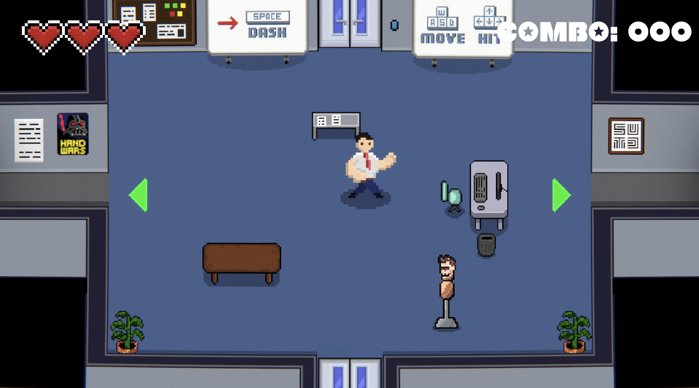
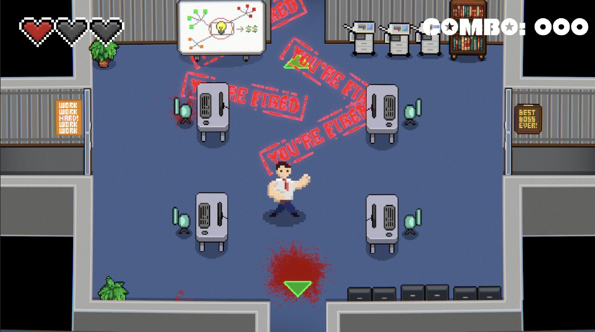
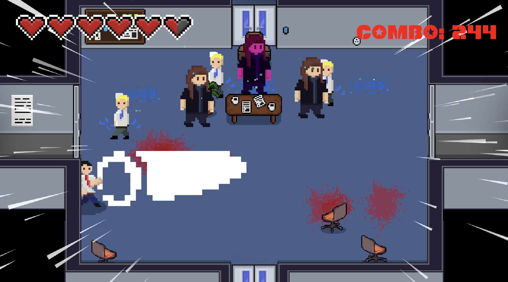

## BIG HANDS

Big Hands is a top-down 2D dungeon crawler roguelike game inspired by The Binding of Isaac. The player plays as an angry 9-to-5 office worker. Unsatisfied with his working conditions, he wreaks havoc upon the Small Hand Corporation with the aim to bring down the villainous CEO.

- The genre: 2D Topdown Fighting, RPG, Roguelike
- The premise: corporate rage: The protagonist is tired of working in their 9 to 5 corporate job and rages. He then decides to kill everyone while climbing the corporate ladder.

### How to play the game

Controls:
- 4-directional movement with WASD
- 4-directional punch attack with arrow keys
- The Player can dash with Space. While dashing, the user moves faster for a fixed distance
- Esc: Pause the game
- R: Restart

### Gameplay

A link to your gameplay recording video

### Other information

You may put whatever important information you want here that describes your game or help players better
